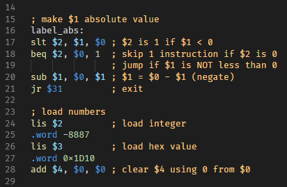
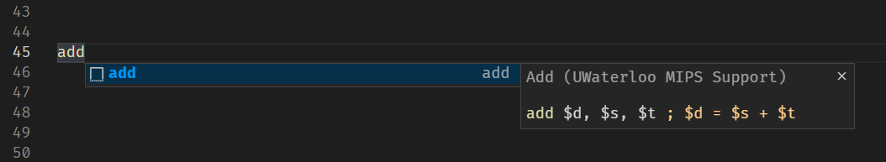

# University of Waterloo MIPS Support

This VSCode extension provides basic MIPS colorization and snippets support for the flavour of MIPS taught in the University of Waterloo's CS241 and CS230 courses.

### Colors

### Snippets

The extension is based on Textmate's [MIPS bundle](https://github.com/textmate/mips.tmbundle)

## Usage

Install the extension and open a `.asm`, `.s` or `.mips` file and start coding!
